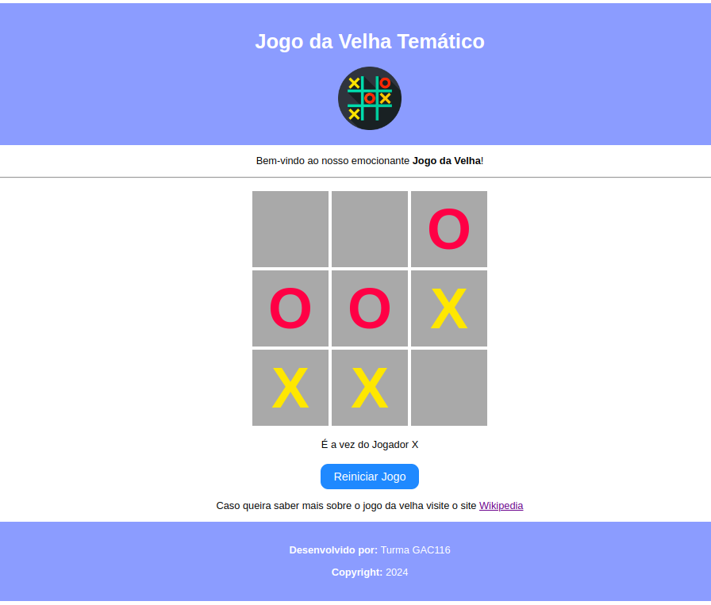
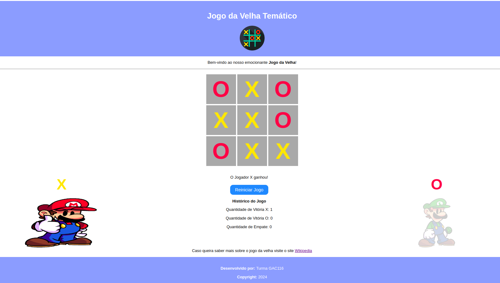

# Aula de Introdução ao HTML, CSS e JavaScript

<p align="center">
  <a href="#">
    
  </a>
  <a href="#">
    
  </a>
  <a href="#">
    
  </a>
</p>

## Índice

* [Introdução](#introdução)
* [Recursos Utilizados](#recursos-utilizados)
* [Fundamentos Teóricos](#fundamentos-teóricos)
* [Objetivo da Aula](#objetivo-da-aula)
* [Desenvolvimento do Projeto](#desenvolvimento-do-projeto)
* [Desenvolva Novos Projetos](#desenvolva-novos-projetos)
* [Créditos e Referências](#créditos-e-referências)

## Introdução

<a href="#índice"></a>

O objetivo deste tutorial é introduzir os conceitos fundamentais de HTML, CSS e JavaScript por meio do desenvolvimento de um projeto completo, que servirá como exemplo prático da camada de apresentação. Esse projeto será utilizado na disciplina GAC116 - Programação Web da Universidade Federal de Lavras (UFLA).

O projeto proposto consiste na criação de um jogo da velha interativo, com dois personagens que disputam entre si. A cada jogada, uma pequena animação será exibida, tornando a experiência mais dinâmica. Além disso, o jogo registrará o histórico dos resultados das partidas anteriores.

A aula está organizada no formato de tutorial, permitindo que cada estudante replique em seu computador os conceitos e recursos apresentados. O código será desenvolvido gradualmente, de modo a evidenciar a evolução da solução e facilitar a compreensão de como as tecnologias HTML, CSS e JavaScript se integram na construção de aplicações web.

## Recursos Utilizados

<a href="#índice"></a>

A seguir estão listados os principais recursos empregados no desenvolvimento desta aula.

### Linguagens

* HTML - Responsável pela estrutura do conteúdo
    * [Link do curso da W3Schools](https://www.w3schools.com/html/default.asp)
* CSS - Responsável pela apresentação visual
    * [Link do curso da W3Schools](https://www.w3schools.com/css/default.asp)
* JavaScript - Responsável pelo comportamento e interatividade
    * [Link do curso da W3Schools](https://www.w3schools.com/js/default.asp)

### Bibliotecas

* jQuery - Biblioteca que simplifica a manipulação do JavaScript
    * [Link site oficial jQuery](https://jquery.com/)
    * [Link do curso da W3Schools](https://www.w3schools.com/jquery/default.asp)

### Ferramentas

* Visual Studio Code - Ambiente de Desenvolvimento Integrado - [Link](https://code.visualstudio.com/)
* Git - Sistema de controle de versão - [Link](https://git-scm.com/)
* Github - Plataforma de hospedagem e colaboração em projetos de software - [Link](https://github.com/)
* Live Server (Extensão VS Code) - Servidor web para desenvolvimento local - [Link](https://marketplace.visualstudio.com/items?itemName=ritwickdey.LiveServer)
* http.server - Servidor web simples incluso na biblioteca padrão do Python - [Link](https://docs.python.org/3/library/http.server.html)

## Fundamentos Teóricos

<a href="#índice"></a>

A seguir estão destacados alguns dos principais fundamentos teóricos para entendimento deste tutorial.

### Arquitetura Web de Três Camadas

A arquitetura web de três camadas é um padrão de design de software que organiza uma aplicação em três níveis distintos, cada um com responsabilidades bem definidas. Essas camadas são:

**1. Camada de Apresentação (Frontend)**:

* Também chamada de interface de usuário, essa camada é responsável pela interação com o usuário. Ela inclui tudo o que o usuário vê e utiliza para interagir com o sistema, como páginas web, formulários, botões, e elementos visuais em geral.
* Aqui, são usados tecnologias como HTML, CSS, JavaScript e frameworks frontend (React, Angular, etc.).
* A camada de apresentação envia as entradas dos usuários para a camada de negócios e exibe os resultados de volta para o usuário.

**2. Camada de Negócios (Lógica da Aplicação - Backend)**:

* Nessa camada está a lógica de negócios da aplicação, ou seja, as regras que governam como os dados devem ser processados e as operações que devem ser realizadas. Ela trata os pedidos recebidos da camada de apresentação e executa as operações necessárias.
* Essa camada pode incluir validações, cálculos e chamadas ao banco de dados. Em termos de tecnologia, é geralmente desenvolvida com linguagens de programação como Python, Java, PHP, ou frameworks como Django, Spring Boot, Laravel, etc.

**3. Camada de Dados (Banco de Dados - Backend)**:

* A camada de dados gerencia o armazenamento e recuperação de dados em um banco de dados. Ela é responsável pela persistência dos dados e operações como criar, ler, atualizar e deletar (CRUD).
* Geralmente, são usados sistemas de gerenciamento de banco de dados relacionais (como MySQL, PostgreSQL) ou não relacionais (como MongoDB).
* A camada de negócios interage com essa camada para armazenar e buscar dados conforme necessário.

**Fluxo da Arquitetura de Três Camadas**:

* O usuário interage com a Camada de Apresentação.
* A Camada de Apresentação faz requisições para a Camada de Negócios.
* A Camada de Negócios processa a lógica e, se necessário, interage com a Camada de Dados.
* A Camada de Dados responde com os dados necessários para a Camada de Negócios.
* A Camada de Negócios retorna os resultados processados para a Camada de Apresentação.
* A Camada de Apresentação exibe os resultados para o usuário.

Essa separação facilita a manutenção e escalabilidade da aplicação, permitindo que cada camada possa ser modificada ou melhorada de forma independente.


Fonte: [https://blog.grancursosonline.com.br/arquitetura-em-tres-camadas-para-aplicacoes-web/](https://blog.grancursosonline.com.br/arquitetura-em-tres-camadas-para-aplicacoes-web/)

O presente projeto foca no desenvolvimento da Camada de Apresentação. Essa camada pode ser organizada através da separação em HTML (ou estrutura), CSS (ou apresentação) e JavaScript (ou comportamento).


Fonte: [https://twitter.com/cewebbr/status/1290302291388424193/photo/1](https://twitter.com/cewebbr/status/1290302291388424193/photo/1)

## Objetivo da Aula

<a href="#índice"></a>

O objetivo desta aula é oferecer uma introdução aos conceitos de HTML, CSS e JavaScript, aplicados de forma prática no desenvolvimento de um jogo da velha temático.

A animação apresentada a seguir ilustra, de maneira visual, o resultado esperado após a implementação dos passos descritos ao longo da aula.


[Link - Jogo Online](https://ufla-prog-web.github.io/aula-html-css-js/page/)

## Desenvolvimento do Projeto

<a href="#índice"></a>

Siga os passos abaixo para alcançar o objetivo proposto: desenvolver o **Jogo da Velha Temático**.

### Clonar o Repositório

Para iniciar, faça o clone do repositório com o seguinte comando:

```bash
git clone https://github.com/ufla-prog-web/aula-html-css-js.git
```

### Baixar o Repositório

Como alternativa ao clone, você pode baixar diretamente o repositório acessando este [link](https://github.com/ufla-prog-web/aula-html-css-js). Clique em `Code` e, em seguida, em `Download ZIP`.

### Abrir o Visual Studio Code

Abra o Visual Studio Code (VS Code) na pasta `aula-html-css-js`.

**Dica:** abra o arquivo `README.md` e selecione a opção `Open Preview to the Side` para visualizar o tutorial lado a lado enquanto desenvolve a aplicação.

### Criar a Estrutura do Jogo - HTML

O desenvolvimento de qualquer página web inicia-se pela definição de sua estrutura em HTML. Nesta etapa, o foco está na organização do conteúdo da página, e não em sua aparência visual.

**Criando o HTML**

Crie uma pasta chamada `code` na raiz do projeto `aula-html-css-js`. Em seguida, crie dentro dela um arquivo chamado `index.html` e copie o código a seguir:

```html
<!DOCTYPE html>
<html>
    <head>
        <meta charset="utf-8">
        <title>Jogo da Velha</title>
    </head>
    <body>
        <div>
            <h1>Jogo da Velha Temático</h1>        
            
            <p>Bem-vindo ao nosso emocionante <b>Jogo da Velha</b>!</p>
            <hr>
            <!-- Abaixo temos os campos necessários ao jogo (isso é um comentário) -->
            <div>
                <div></div>
                <div></div>
                <div></div>
                <div></div>
                <div></div>
                <div></div>
                <div></div>
                <div></div>
                <div></div>
            </div>
            <button>Reiniciar Jogo</button>
            <p>
                Caso queira saber mais sobre o jogo da velha visite o site
                <a href="https://pt.wikipedia.org/wiki/Jogo_da_velha" target="_blank">Wikipedia</a>
            </p>
            <p><b>Desenvolvido por:</b> Turma GAC116</p>
            <p><b>Copyright:</b> 2025</p>
        </div>
    </body>
</html>
```

**Explicação sobre o código HTML**

* `<!DOCTYPE html>`: define que o documento segue o padrão HTML5.
* `<html>`: elemento raiz de toda página HTML.
* `<head>`: contém informações sobre a página, como metadados e título.
* `<meta>`: define a codificação de caracteres utilizada.
* `<title>`: define o título exibido na aba do navegador.
* `<body>`: representa o corpo do documento.
* `<div>`: cria uma divisão lógica no layout da página.
* `<h1>`: define um título grande.
* ``: insere uma imagem.
* `<p>`: representa um parágrafo de texto.
* `<b>`: exibe o texto em negrito.
* `<hr>`: insere uma barra horizontal.
* `<button>`: cria um botão interativo.
* `<a>`: define um hiperlink para outra página ou recurso.

Observe que a maioria dos elementos HTML possui uma tag de abertura e uma tag de fechamento, como `<title>` e `</title>`. Entretanto, existem algumas exceções, como `<hr>`, que não possuem fechamento. Alguns elementos possuem atributos, como o elemento `` que possui os atributos `src`, `alt`, `width` e `height`.

Por fim, copie o arquivo `img_logo.png` da pasta `page` para a pasta `code`.

### Executar a Aplicação Web

Abra o arquivo `index.html` em um navegador para visualizar o conteúdo da página. Isso pode ser feito de duas maneiras:

1. Acessando diretamente o arquivo:
    * Abra o arquivo HTML como faria com qualquer outro arquivo do seu computador.
2. Utilizando um servidor web local:
    * Se você possui a extensão Live Server instalada no Visual Studio Code, clique com o botão direito no arquivo e selecione `Open with Live Server`.
    * Caso não tenha a extensão instalada, é recomendável instalá-la, pois ela facilita o desenvolvimento.
    * Outra alternativa é iniciar manualmente um servidor web no diretório que contém o arquivo `index.html`. Para isso, execute o comando abaixo:

        ```bash
        cd code
        python3 -m http.server
        ```

        Se desejar utilizar uma porta específica (por exemplo, 8123), execute:

        ```bash
        cd code
        python3 -m http.server 8123
        ```

Após iniciar o servidor, abra o navegador e acesse a página. O resultado deverá se assemelhar à imagem abaixo:


Note que, neste momento, a página ainda está simples e com aparência pouco atrativa. Nas próximas etapas, trabalharemos o estilo para deixá-la mais organizada e visualmente agradável.

### Criar Estilos da Apresentação no Jogo - HTML + CSS

Nessa etapa, iremos melhorar o aspecto visual da nossa página web através da incorporação de estilos em CSS (*Cascading Style Sheets* ou Folhas de Estilo em Cascata).

**Atualizando o HTML**

Altere o arquivo `index.html`, localizado na pasta `code`, substituindo seu conteúdo pelo código abaixo:

```html
<!DOCTYPE html>
<html lang="pt-BR">
    <head>
        <meta charset="utf-8">
        <meta name="viewport" content="width=device-width, initial-scale=1.0">
        <title>Jogo da Velha</title>
        <link rel="stylesheet" href="styles.css">
    </head>
    <body>
        <div class="conteiner">
            <h1>Jogo da Velha Temático</h1>        
            
            <p>Bem-vindo ao nosso emocionante <b>Jogo da Velha</b>!</p>
            <hr>
            <div class="tabuleiro">
                <div class="celula"></div>
                <div class="celula"></div>
                <div class="celula"></div>
                <div class="celula"></div>
                <div class="celula"></div>
                <div class="celula"></div>
                <div class="celula"></div>
                <div class="celula"></div>
                <div class="celula"></div>
            </div>
            <button>Reiniciar Jogo</button>
            <p>
                Caso queira saber mais sobre o jogo da velha visite o site
                <a href="https://pt.wikipedia.org/wiki/Jogo_da_velha" target="_blank">Wikipedia</a>
            </p>
            <p><b>Desenvolvido por:</b> Turma GAC116</p>
            <p><b>Copyright:</b> 2025</p>
        </div>
    </body>
</html>
```

**Explicação sobre as alterações no HTML**

* `lang="pt-BR"`: define o idioma principal do conteúdo como Português do Brasil, importante para acessibilidade, internacionalização e motores de busca.
* `<meta charset="utf-8">`: especifica a codificação de caracteres utilizada na página.
* `<meta name="viewport" ...>`: ajusta a exibição em dispositivos móveis, controlando largura e escala inicial.
* `<link rel="stylesheet" href="styles.css">`: vincula a folha de estilo externa "styles.css" ao documento HTML. Quando você usa `<link rel="stylesheet" href="styles.css">`, está basicamente dizendo ao navegador para carregar o arquivo "styles.css" e aplicar suas regras de estilo ao documento HTML atual.
* `class`: a inclusão de classe dentro do elemento `<div class="nome_da_classe">` é usado para associar um ou mais nomes de classes a um elemento HTML. As classes são usadas principalmente para associar um elemento com regras de estilo em um arquivo CSS externo ou interno, ou para selecionar e manipular elementos com JavaScript.

**Criando o CSS**

Agora, crie um arquivo chamado `styles.css` dentro da pasta `code` e insira o seguinte conteúdo:

```css
.conteiner {
    text-align: center;
    font-size: 16px;
}

.tabuleiro {
    display: grid;
    grid-template-columns: repeat(3, 120px);
    grid-gap: 5px;
    margin: 20px auto;
    justify-content: center;
}

.celula {
    width: 120px;
    height: 120px;
    background-color: darkgray;
    cursor: pointer;
}
```

**Explicação sobre as alterações no CSS**

* `.conteiner`: Este é um seletor CSS que aplica estilos a elementos que possuem a classe "conteiner" em seu HTML.
  * `text-align: center;`: Isso centraliza o texto dentro dos elementos com a classe "conteiner".
  * `font-size: 16px;`: Define o tamanho da fonte como 16 pixels para elementos com a classe "conteiner".

* `.tabuleiro`: Este é um seletor CSS que aplica estilos a elementos que possuem a classe "tabuleiro" em seu HTML.
  * `display: grid;`: Define o layout do elemento como uma grade.
  * `grid-template-columns: repeat(3, 120px);`: Define as colunas da grade, repetindo 3 vezes uma coluna de largura 120 pixels.
  * `grid-gap: 5px;`: Define o espaçamento entre as células da grade como 5 pixels.
  * `margin: 20px auto;`: Define uma margem superior e inferior de 20 pixels e margens laterais automáticas para centralizar o elemento horizontalmente na página.
  * `justify-content: center;`: Define o alinhamento horizontal do conteúdo da grade como centralizado.

* `.celula`: Este é um seletor CSS que aplica estilos a elementos que possuem a classe "celula" em seu HTML.
  * `width: 120px;`: Define a largura das células como 120 pixels.
  * `height: 120px;`: Define a altura das células como 120 pixels.
  * `background-color: darkgray;`: Define a cor de fundo das células como cinza escuro.
  * `cursor: pointer;`: Define o cursor do mouse como um ponteiro ao passar sobre as células, indicando que elas são interativas.

**Visualização**

Abra novamente o arquivo `index.html` no navegador. O resultado deverá se assemelhar à imagem abaixo:


Agora, a página apresenta um visual mais organizado e agradável, graças à aplicação do CSS.

### Melhorar a Visualização do Jogo - HTML + CSS

Nesta etapa, vamos aprimorar a aparência da página web. Para isso, atualizaremos tanto o HTML quanto o CSS. No HTML, será criada uma estrutura com cabeçalho (`<header>`) e rodapé (`<footer>`). No CSS, aplicaremos estilos ao `body`, `header`, `footer` e `button`.

Atualize o conteúdo do arquivo `index.html` com o código abaixo:

```html
<!DOCTYPE html>
<html lang="pt-BR">
    <head>
        <meta charset="utf-8">
        <meta name="viewport" content="width=device-width, initial-scale=1.0">    
        <title>Jogo da Velha</title>
        <link rel="stylesheet" href="styles.css">
    </head>
    <body>
        <div class="conteiner">
            <header>
                <h1>Jogo da Velha Temático</h1>        
                
            </header>
            <p>Bem-vindo ao nosso emocionante <b>Jogo da Velha</b>!</p>
            <hr>
            <div class="tabuleiro">
                <div class="celula"></div>
                <div class="celula"></div>
                <div class="celula"></div>
                <div class="celula"></div>
                <div class="celula"></div>
                <div class="celula"></div>
                <div class="celula"></div>
                <div class="celula"></div>
                <div class="celula"></div>
            </div>
            <button>Reiniciar Jogo</button>
            <p>
                Caso queira saber mais sobre o jogo da velha visite o site
                <a href="https://pt.wikipedia.org/wiki/Jogo_da_velha" target="_blank">Wikipedia</a>
            </p>
            <footer>
                <p><b>Desenvolvido por:</b> Turma GAC116</p>
                <p><b>Copyright:</b> 2025</p>
            </footer>
        </div>
    </body>
</html>
```

**Alterações no HTML**

* `<header>`: define o cabeçalho da página. Esse cabeçalho geralmente contém informações introdutórias ou de navegação para o conteúdo principal da página. Dentro desse cabeçalho foram colocados o título e a logo da página web.
* `<footer>`: define o rodapé da página. Dentro desse rodapé foram colocados dois parágrafos.

Agora, adicione ao final do arquivo `styles.css` o seguinte código:

```css
...

body {
    font-family: Arial, sans-serif;
}

header {
    background-color: #8AF;
    color: #FFF;
    padding: 20px;
}

footer {
    background-color: #8AF;
    color: #FFF;
    padding: 20px;
}

button {
    background-color: #39F;
    color: white;
    cursor: pointer;
    font-size: 18px;
    border: none;
    border-radius: 12px;
    padding: 10px 20px;
    margin-top: 5px;
}

button:hover {
    background-color: #17D;
}
```

**Alterações no CSS**

* O seletor `body` é usado para aplicar estilos ao elemento `<body>` do documento HTML. O elemento `<body>` é o elemento principal que contém todo o conteúdo visível de uma página da web. Quando você aplica estilos usando o seletor `body`, esses estilos afetam todo o conteúdo da página, a menos que sejam anulados por estilos aplicados a elementos filhos de forma mais específica.
    * `font-family: Arial, sans-serif;`: Esta regra define a família de fontes para o texto dentro do elemento `<body>`. A primeira escolha de fonte é "Arial", uma fonte sans-serif comum, que será usada se estiver disponível no sistema do usuário. Se "Arial" não estiver disponível, o navegador procurará por uma fonte sans-serif genérica para usar, que é especificada como "sans-serif". Isso garante que o texto dentro do elemento `<body>` seja exibido com uma fonte legível, como Arial, ou, se Arial não estiver disponível, uma fonte sans-serif genérica.
* O seletor `header` é usado para aplicar estilos ao elemento `<header>` do documento HTML.
    * `background-color: #8AF;`: Esta regra define a cor de fundo do elemento `<header>`. A cor de fundo é definida como "#8AF", que é uma cor em formato hexadecimal. Isso dará ao cabeçalho uma cor de fundo azul claro.
    * `color: #FFF;`: Esta regra define a cor do texto dentro do elemento `<header>`. A cor do texto é definida como "#FFF", que é uma cor em formato hexadecimal representando branco. Isso fará com que o texto dentro do cabeçalho seja exibido em branco.
    * `padding: 20px;`: Esta regra define o preenchimento interno do elemento `<header>`. O preenchimento interno é a distância entre o conteúdo do elemento e suas bordas. Neste caso, o preenchimento é definido como "20px", o que significa que haverá um espaço de 20 pixels entre o conteúdo dentro do cabeçalho e suas bordas. Isso proporcionará um espaço ao redor do conteúdo dentro do cabeçalho, dando uma aparência mais espaçosa e esteticamente agradável.
* O seletor `footer` é usado para aplicar estilos ao elemento `<footer>` do documento HTML.
* O seletor `button` é usado para aplicar estilos a todos os elementos `<button>` do documento HTML.
    * `background-color: #39F;`: Esta regra define a cor de fundo dos botões. A cor de fundo é definida como "#39F", que é uma cor azul em formato hexadecimal.
    * `color: white;`: Esta regra define a cor do texto dos botões como branco.
    * `cursor: pointer;`: Esta regra define o cursor do mouse ao passar sobre os botões como um ponteiro, indicando que eles são clicáveis.
    * `font-size: 18px;`: Esta regra define o tamanho da fonte dos textos nos botões como 18 pixels.
    * `border: none;`: Esta regra remove a borda dos botões, deixando-os sem bordas visíveis.
    * `border-radius: 12px;`: Esta regra define o raio do canto dos botões como 12 pixels, dando-lhes uma aparência arredondada.
    * `padding: 10px 20px;`: Esta regra define o preenchimento interno dos botões. O preenchimento é de 10 pixels na parte superior e inferior e de 20 pixels nos lados esquerdo e direito, proporcionando espaço ao redor do texto dentro dos botões.
    * `margin-top: 5px;`: Esta regra define uma margem superior de 5 pixels para os botões, dando espaço entre eles e os elementos acima deles.
* O seletor `button:hover` é usado para aplicar estilos aos elementos `<button>` quando o cursor do mouse está sobre eles (quando estão em estado de hover).
    * `background-color: #17D;`: Esta regra define a cor de fundo dos botões quando o cursor do mouse está sobre eles. A cor de fundo é definida como "#17D", que é uma cor azul mais escura em formato hexadecimal.

Abra novamente o arquivo `index.html` no navegador. O resultado deverá se assemelhar à imagem abaixo:


Observe que, até este ponto, o tabuleiro ainda não possui interatividade, ou seja, clicar nas células não gera nenhuma jogada. Na próxima etapa, iremos adicionar comportamentos a nossa página com JavaScript.

### Criar Interatividade no Jogo - HTML + CSS + JS

Nesta etapa, vamos tornar o nosso jogo interativo com o uso de JavaScript. Para isso, iremos atualizar o HTML e o CSS da página, além de criar um código JavaScript. No HTML, iremos chamar o código do JavaScript e colocar os eventos para ouvir os cliques do botão do mouse. No CSS, iremos estilizar a célula um pouco mais. No JavaScript, iremos permitir fazer jogadas e permitir reiniciar o jogo.

**Atualizando o HTML**

Substitua o conteúdo do arquivo `index.html` pelo seguinte código:

```html
<!DOCTYPE html>
<html lang="pt-BR">
    <head>
        <meta charset="utf-8">
        <meta name="viewport" content="width=device-width, initial-scale=1.0">    
        <title>Jogo da Velha</title>
        <link rel="stylesheet" href="styles.css">
    </head>
    <body>
        <div class="conteiner">
            <header>
                <h1>Jogo da Velha Temático</h1>        
                
            </header>
            <p>Bem-vindo ao nosso emocionante <b>Jogo da Velha</b>!</p>
            <hr>
            <div class="tabuleiro">
                <div class="celula" onclick="fazerMovimento(0)"></div>
                <div class="celula" onclick="fazerMovimento(1)"></div>
                <div class="celula" onclick="fazerMovimento(2)"></div>
                <div class="celula" onclick="fazerMovimento(3)"></div>
                <div class="celula" onclick="fazerMovimento(4)"></div>
                <div class="celula" onclick="fazerMovimento(5)"></div>
                <div class="celula" onclick="fazerMovimento(6)"></div>
                <div class="celula" onclick="fazerMovimento(7)"></div>
                <div class="celula" onclick="fazerMovimento(8)"></div>
            </div>
            <button onclick="reiniciarJogo()">Reiniciar Jogo</button>
            <p>
                Caso queira saber mais sobre o jogo da velha visite o site
                <a href="https://pt.wikipedia.org/wiki/Jogo_da_velha" target="_blank">Wikipedia</a>
            </p>
            <footer>
                <p><b>Desenvolvido por:</b> Turma GAC116</p>
                <p><b>Copyright:</b> 2025</p>
            </footer>
        </div>
        <script src="script.js"></script>
    </body>
</html>
```

**Explicação sobre as alterações no HTML**

* O elemento `<div>` da classe "celula" agora ouve um evento de click `onclick="fazerMovimento(x)`. Ao receber um click do mouse (botão esquerdo) o método do JavaScript chamado `fazerMovimento` é chamado com o valor `x` passado como parâmetro.
* O elemento `<button>` agora ouve um evento de click `onclick="reiniciarJogo()`. Ao receber um click do mouse (botão esquerdo) o método do JavaScript chamado `reiniciarJogo` é chamado sem nenhum parâmetro.
* O elemento `<script>`, no final do arquivo, carrega um arquivo JavaScript chamado `script.js`.

**Atualizando o CSS**

Modifique o seletor `.celula` em `styles.css` para incluir novos estilos:

```css
...

.celula {
    width: 120px;
    height: 120px;
    background-color: darkgray;
    cursor: pointer;
    display: flex;
    justify-content: center;
    align-items: center;
    font-size: 90px;
    font-weight: bold;
}

...
```

**Explicação sobre as alterações no CSS**

* `display: flex;`: Esta regra define o modelo de layout flexível para os elementos com a classe "celula", permitindo um controle mais preciso sobre o posicionamento dos elementos internos.
* `justify-content: center;` Esta regra centraliza os itens dentro dos elementos da classe "celula" horizontalmente.
* `align-items: center;`: Esta regra centraliza os itens dentro dos elementos da classe "celula" verticalmente.
* `font-size: 90px;`: Esta regra define o tamanho da fonte dos elementos com a classe "celula" como 90 pixels.
* `font-weight: bold;`: Esta regra define o estilo da fonte como negrito para os elementos com a classe "celula".

**Criando o JavaScript**

Crie um arquivo chamado `script.js` na pasta `code` e adicione o seguinte código:

```javascript
let jogadorAtual = 'X';
let tabuleiro = ['', '', '', '', '', '', '', '', ''];

function fazerMovimento(index) {
    if (tabuleiro[index] == '') {
        tabuleiro[index] = jogadorAtual;
        document.getElementsByClassName('celula')[index].textContent = jogadorAtual;
        jogadorAtual = jogadorAtual == 'X' ? 'O' : 'X';
    }
}

function reiniciarJogo() {
    jogadorAtual = 'X';
    tabuleiro = ['', '', '', '', '', '',  '', '', ''];
    const celulas = document.getElementsByClassName('celula');
    for (let i = 0; i < celulas.length; i++) {
        celulas[i].textContent = '';
    }
}
```

**Explicações do código JavaScript**

* `let jogadorAtual = 'X';`: Cria uma variável chamada jogadorAtual e a incializa com o valor 'X'.
* `let tabuleiro = ['', '', '',  '', '', '',  '', '', ''];`: Cria uma variável chamada tabuleiro e a incializa como um vetor de valores vazio `''`.
* `fazerMovimento(index)`: Esta função é chamada quando um jogador faz um movimento clicando em uma célula do tabuleiro. Ela recebe um índice como argumento, que representa a posição da célula no tabuleiro. Se a célula estiver vazia (representada por `''` no array tabuleiro), o jogador atual pode fazer o movimento. A função atualiza o estado do tabuleiro, definindo o valor da célula correspondente como o símbolo do jogador atual ('X' ou 'O'). Em seguida, atualiza o texto da célula no HTML para mostrar o símbolo do jogador atual. Por fim, alterna o jogador atual entre 'X' e 'O', para que o próximo jogador possa fazer o movimento.
* `reiniciarJogo()`: Esta função é chamada quando o jogo precisa ser reiniciado. Ela redefine o jogador atual como 'X' e limpa o tabuleiro, preenchendo-o com valores vazios ''. Em seguida, percorre todas as células do tabuleiro no HTML e remove o texto delas, deixando as células vazias novamente.

**O que é DOM?**

Como o JavaScript interage com sua página web? O JavaScript faz essa interação através do DOM (*Document Object Model* ou Modelo de Documento do Objeto). Com o JavaScript você pode acessar e alterar elementos, além de poder adicionar novos elementos ao DOM.

O que é o DOM? O DOM trata da modelagem de todo o HTML. O DOM é como uma árvore genealógica. O elemento que antecede o document é o window, que nada mais é que a janela do navegador. Em sua estrutura, o document está no topo como objeto global e tem como elemento raiz a tag html e todas as outras descendem dela através das suas ramificações (branchs). A tag html, objeto pai, apresenta dois objetos filhos: o head e o body. A tag head é pai da tag title, e a body é pai das tags a e h1, e assim sucessivamente, de acordo com a hierarquia.


Fonte: [https://en.wikipedia.org/wiki/Document_Object_Model](https://en.wikipedia.org/wiki/Document_Object_Model)

A seguir estão listados alguns dos métodos no JavaScript para acesso ao DOM:

* `document.getElementById(ID);`
* `document.getElementsByClassName(CLASS_NAME);`
* `document.getElementsByTagName(TAG_NAME);`

**Visualização**

Abra o arquivo `index.html` no navegador. O resultado deverá se assemelhar à imagem abaixo:


Agora o jogo já permite realizar jogadas e reiniciar a partida.

### Melhorar a Interatividade no Jogo - HTML + CSS + JS

Nesta etapa, vamos aumentar a interatividade do jogo por meio de um campo de status que exibirá informações na tela. Esse campo mostrará de quem é a vez de jogar e, quando houver um vencedor ou empate, apresentará a mensagem correspondente. Além disso, o JavaScript será usado para aplicar uma estilização diferenciada aos símbolos no tabuleiro.

**Atualizando o HTML**

No arquivo `index.html`, adicione a seguinte linha antes do botão:

```html
...
<body>
    <div class="conteiner">
        ...
        <p id="status"></p> <!--Acrescentar apenas essa linha antes do botão-->
        <button onclick="reiniciarJogo()">Reiniciar Jogo</button>
        ...
    </div>
</body>
```

**Alteração no HTML**

* Criamos um elemento `<p>` com o atributo `id="status"`. Esse parágrafo começa vazio e será preenchido dinamicamente pelo JavaScript com mensagens sobre o andamento da partida.

**Observação**: o arquivo CSS não precisa ser alterado nesta etapa.

**Atualizando o JavaScript**

Substitua o conteúdo do arquivo `script.js` pelo seguinte:

```javascript
let jogoAtivo = true;
let jogadorAtual = 'X';
let tabuleiro = ['', '', '', '', '', '', '', '', ''];

const padroesVitoria = [
    [0, 1, 2], //primeira linha
    [3, 4, 5], //segunda linha
    [6, 7, 8], //terceira linha
    [0, 3, 6], //primeira coluna
    [1, 4, 7], //segunda coluna
    [2, 5, 8], //terceira coluna
    [0, 4, 8], //diagonal principal
    [2, 4, 6]  //diagonal secundária
];

function verificaVencedor() {
    for (let i = 0; i < padroesVitoria.length; i++) {
        const [a, b, c] = padroesVitoria[i];
        if (tabuleiro[a] && tabuleiro[a] == tabuleiro[b] && tabuleiro[a] == tabuleiro[c]) {
            jogoAtivo = false;
            return tabuleiro[a];
        }
    }
    if (!tabuleiro.includes('')) {
        jogoAtivo = false;
        return 'empate';
    }
    return null;
}

function mostrarStatus() {
    const vencedor = verificaVencedor();
    const elementoStatus = document.getElementById('status');
    if (vencedor) {
        if (vencedor == 'empate') {
            elementoStatus.textContent = "Empate!";
        } else {
            elementoStatus.textContent = `O Jogador ${vencedor} ganhou!`;
        }
    } else {
        elementoStatus.textContent = `É a vez do Jogador ${jogadorAtual}`;
    }
}

function fazerMovimento(index) {
    if (jogoAtivo && tabuleiro[index] == '') {
        tabuleiro[index] = jogadorAtual;
        document.getElementsByClassName('celula')[index].textContent = jogadorAtual;
        if (jogadorAtual == 'X'){
            document.getElementsByClassName('celula')[index].style.color = "#FD0";
        } else {
            document.getElementsByClassName('celula')[index].style.color = "#F44";
        }
        jogadorAtual = jogadorAtual == 'X' ? 'O' : 'X';
        mostrarStatus();
    }
}

function reiniciarJogo() {
    jogoAtivo = true;
    jogadorAtual = 'X';
    tabuleiro = ['', '', '', '', '', '', '', '', ''];
    const celulas = document.getElementsByClassName('celula');
    for (let i = 0; i < celulas.length; i++) {
        celulas[i].textContent = '';
    }
    mostrarStatus();
}

mostrarStatus();
```

**Explicações do Código JavaScript**

* `jogoAtivo`: Uma variável booleana que indica se o jogo está ativo ou não.
* `padroesVitoria`: Uma matriz que define os padrões de vitória no jogo da velha. Cada subarray representa uma linha, coluna ou diagonal no tabuleiro onde um jogador pode ganhar.
* `verificaVencedor()`: Uma função que verifica se um jogador ganhou o jogo ou se houve um empate.
* `mostrarStatus()`: Uma função que atualiza o elemento HTML com o status atual do jogo (quem está ganhando, se houve um empate ou de quem é a vez de jogar).
* `fazerMovimento(index)`: Uma função chamada quando um jogador faz um movimento clicando em uma célula do tabuleiro. Esta função verifica se o movimento é válido, atualiza o estado do tabuleiro, muda o jogador atual e atualiza o status do jogo.
* `reiniciarJogo()`: Uma função chamada para reiniciar o jogo, redefinindo todas as variáveis para seus valores iniciais e limpando o tabuleiro.

**Visualização**

Abra o arquivo `index.html` no navegador. O resultado deverá se parecer com a imagem abaixo:



Agora o jogo exibe dinamicamente o status da partida e destaca visualmente com cores os símbolos dos jogadores, tornando a experiência mais clara e interativa.

### Tornar o Jogo Temático e Dinâmico - HTML + CSS + JS

Nessa etapa, iremos tornar o nosso jogo temático e dinâmico. Por temático quermos dizer que iremos colocar dois jogadores no jogo da Velha e os mesmos são do conhecido jogo "Mario Bros" (Mario e Luigi). Para isso, iremos atualizar o HTML, o CSS e JavaScript da página web.
No HTML, iremos colocar duas imagens `gif` dos personagens citados, além de adicionar o histórico de vitórias. No CSS, iremos colocar mais alguns elementos para estilização dos dois personagens. No JavaScript, iremos colocar animações estilizadas quando um dos jogadores ganhar, além de animações sinalizando a vez de cada jogador.

**Atualizando o HTML**

Antes de começar, copie os arquivos `img_mario.gif` e `img_luigi.gif` da pasta `page` para a pasta `code`.

Substitua o conteúdo do arquivo `index.html` pelo código abaixo:

```html
<!DOCTYPE html>
<html lang="pt-BR">
    <head>
        <meta charset="utf-8">
        <meta name="viewport" content="width=device-width, initial-scale=1.0">    
        <title>Jogo da Velha</title>
        <link rel="stylesheet" href="styles.css">
    </head>
    <body>
        <div class="conteiner">
            <header>
                <h1>Jogo da Velha Temático</h1>        
                
            </header>
            <p>Bem-vindo ao nosso emocionante <b>Jogo da Velha</b>!</p>
            <hr>
            <div class="tabuleiro">
                <div class="celula" onclick="fazerMovimento(0)"></div>
                <div class="celula" onclick="fazerMovimento(1)"></div>
                <div class="celula" onclick="fazerMovimento(2)"></div>
                <div class="celula" onclick="fazerMovimento(3)"></div>
                <div class="celula" onclick="fazerMovimento(4)"></div>
                <div class="celula" onclick="fazerMovimento(5)"></div>
                <div class="celula" onclick="fazerMovimento(6)"></div>
                <div class="celula" onclick="fazerMovimento(7)"></div>
                <div class="celula" onclick="fazerMovimento(8)"></div>
            </div>
            <div>
                <div class="conteiner_jogo">
                    <h2 id="marcadorX">X</h2>
                    
                </div>
                <div class="conteiner_jogo">
                    <p id="status"></p>
                    <button onclick="reiniciarJogo()">Reiniciar Jogo</button>
                    <p><b>Histórico do Jogo</b></p>
                    <p id="qtdVitoriaX">Quantidade de Vitória X: 0</p>
                    <p id="qtdVitoriaO">Quantidade de Vitória O: 0</p>
                    <p id="qtdEmpate">Quantidade de Empate: 0</p>
                </div>
                <div class="conteiner_jogo">
                    <h2 id="marcadorO">O</h2>
                    
                </div>
            </div>
            <p>
                Caso queira saber mais sobre o jogo da velha visite o site
                <a href="https://pt.wikipedia.org/wiki/Jogo_da_velha" target="_blank">Wikipedia</a>
            </p>
            <footer>
                <p><b>Desenvolvido por:</b> Turma GAC116</p>
                <p><b>Copyright:</b> 2025</p>
            </footer>
        </div>
        <script src="script.js"></script>
    </body>
</html>
```

**Explicação sobre as alterações no HTML**

* `<div>`: Este é um elemento de bloco genérico usado para agrupar outros elementos. Neste caso, três divs estão sendo usadas para dividir a área do jogo em três colunas.
* `<div class="conteiner_jogo">`: Estes são contêineres de jogo que contêm elementos relacionados a cada jogador e ao status do jogo. Eles têm uma largura de 33% do contêiner pai, permitindo que ocupem uma terça parte da largura disponível.
* `<h2 id="marcadorX">X</h2>` e `<h2 id="marcadorO">O</h2>`: Estes são cabeçalhos de nível 2 que exibem o marcador de cada jogador (X e O). Eles têm um ID específico (marcadorX e marcadorO), que é usado para estilização CSS específica.
* `` e ``: Estas são imagens dos personagens do jogo (Mario e Luigi). Cada imagem tem um ID específico (imgX e imgO) e uma classe (img_personagem) para estilização CSS específica.
* `<p id="qtdVitoriaX">Quantidade de Vitória X: 0</p>`, `<p id="qtdVitoriaO">Quantidade de Vitória O: 0</p>` e `<p id="qtdEmpate">Quantidade de Empate: 0</p>`: Estes são parágrafos com IDs específicos (qtdVitoriaX, qtdVitoriaO e qtdEmpate) que serão usados para exibir estatísticas do jogo, como a quantidade de vitórias para cada jogador e a quantidade de empates através da manipulação via JavaScript.

**Atualizando o CSS**

Adicione ao final do arquivo `styles.css`:

```css
...

.conteiner_jogo {
    width: 33%;
    float: left;
}

.img_personagem {
    opacity: 0.2;
}

#marcadorX {
    font-weight: bold;
    font-size: 60px;
    color: #FD0;
    margin: 20px;
}

#marcadorO {
    font-weight: bold;
    font-size: 60px;
    color: #F44;
    margin: 20px;
}
```

**Explicação sobre as alterações no CSS**

* `.conteiner_jogo`: É um seletor de classe CSS.
    * `width: 33%;`: define a largura dos elementos da classe "conteiner_jogo" como 33% da largura do contêiner pai.
    * `float: left;`: faz com que os elementos com a classe "conteiner_jogo" flutuem para a esquerda, permitindo que vários elementos sejam colocados lado a lado.

* `.img_personagem`: é um seletor de classe CSS.
    * `opacity: 0.2;` define a opacidade das imagens com a classe "img_personagem" como 0.2, tornando-as mais transparentes.

* `#marcadorX`: é um seletor de ID CSS, aplicado a um elemento com o atributo id igual a "marcadorX".
    * `font-weight: bold;`: define a fonte como negrito para o texto dentro do elemento com o ID marcadorX.
    * `font-size: 60px;`: define o tamanho da fonte como 60 pixels para o texto dentro do elemento com o ID marcadorX.
    * `color: #FD0;`: define a cor do texto como amarelo (#FD0) para o elemento com o ID marcadorX.
    * `margin: 20px;`: define uma margem de 20 pixels ao redor do elemento com o ID marcadorX.

* `#marcadorO`: é um seletor de ID CSS, aplicado a um elemento com o atributo id igual a "marcadorO".
    * `font-weight: bold;`: define a fonte como negrito para o texto dentro do elemento com o ID marcadorO.
    * `font-size: 60px;`: define o tamanho da fonte como 60 pixels para o texto dentro do elemento com o ID marcadorO.
    * `color: #F44;`: define a cor do texto como vermelho (#F44) para o elemento com o ID marcadorO.
    * `margin: 20px;`: define uma margem de 20 pixels ao redor do elemento com o ID marcadorO.

**Atualizando o JavaScript**

Substitua o conteúdo de `script.js` pelo código abaixo:

```javascript
let jogoAtivo = true;
let jogadorAtual = 'X';
let tabuleiro = ['', '', '', '', '', '', '', '', ''];

let qtdVitoriaX = 0;
let qtdVitoriaO = 0;
let qtdEmpate = 0;

document.getElementById('imgX').style.opacity = 1.0;
document.getElementById('imgO').style.opacity = 0.2;
document.getElementById('imgX').style.width = "150px";
document.getElementById('imgO').style.width = "150px";

const padroesVitoria = [
    [0, 1, 2], //primeira linha
    [3, 4, 5], //segunda linha
    [6, 7, 8], //terceira linha
    [0, 3, 6], //primeira coluna
    [1, 4, 7], //segunda coluna
    [2, 5, 8], //terceira coluna
    [0, 4, 8], //diagonal principal
    [2, 4, 6]  //diagonal secundária
];

function verificaVencedor() {
    for (let i = 0; i < padroesVitoria.length; i++) {
        const [a, b, c] = padroesVitoria[i];
        if (tabuleiro[a] && tabuleiro[a] == tabuleiro[b] && tabuleiro[a] == tabuleiro[c]) {
            jogoAtivo = false;
            return tabuleiro[a];
        }
    }
    if (!tabuleiro.includes('')) {
        jogoAtivo = false;
        return 'empate';
    }
    return null;
}

function mostrarStatus() {
    const vencedor = verificaVencedor();
    const elementoStatus = document.getElementById('status');
    if (vencedor) {
        if (vencedor == 'empate') {
            elementoStatus.textContent = "Empate!";
            document.getElementById('imgX').style.opacity = 1.0;
            document.getElementById('imgO').style.opacity = 1.0;
            qtdEmpate += 1;
            document.getElementById('qtdEmpate').textContent = "Quantidade de Empate: " + qtdEmpate;
        } else {
            elementoStatus.textContent = `O Jogador ${vencedor} ganhou!`;
            if (vencedor == 'X'){
                document.getElementById('imgX').style.opacity = 1.0;
                document.getElementById('imgO').style.opacity = 0.2;
                document.getElementById('imgX').style.width = "300px";
                document.getElementById('imgX').style.transition = "width 1s ease";
                qtdVitoriaX += 1;
                document.getElementById('qtdVitoriaX').textContent = "Quantidade de Vitória X: " + qtdVitoriaX;
            }else {
                document.getElementById('imgO').style.opacity = 1.0;
                document.getElementById('imgX').style.opacity = 0.2;
                document.getElementById('imgO').style.width = "300px";
                document.getElementById('imgO').style.transition = "width 1s ease";
                qtdVitoriaO += 1;
                document.getElementById('qtdVitoriaO').textContent = "Quantidade de Vitória O: " + qtdVitoriaO;
            }
        }
    } else {
        elementoStatus.textContent = `É a vez do Jogador ${jogadorAtual}`;
    }
}

function fazerMovimento(index) {
    if (jogoAtivo && tabuleiro[index] == '') {
        tabuleiro[index] = jogadorAtual;
        document.getElementsByClassName('celula')[index].textContent = jogadorAtual;        
        if (jogadorAtual == 'X'){
            document.getElementsByClassName('celula')[index].style.color = "#FD0";
            document.getElementById('imgO').style.opacity = 1.0;
            document.getElementById('imgX').style.opacity = 0.2;
        } else {
            document.getElementsByClassName('celula')[index].style.color = "#F44";
            document.getElementById('imgX').style.opacity = 1.0;
            document.getElementById('imgO').style.opacity = 0.2;
        }
        jogadorAtual = jogadorAtual == 'X' ? 'O' : 'X';
        mostrarStatus();
    }
}

function reiniciarJogo() {
    jogoAtivo = true;
    jogadorAtual = 'X';
    tabuleiro = ['', '', '', '', '', '', '', '', ''];
    document.getElementById('imgX').style.opacity = 1.0;
    document.getElementById('imgO').style.opacity = 0.2;
    document.getElementById('imgX').style.width = "150px";
    document.getElementById('imgO').style.width = "150px";
    const celulas = document.getElementsByClassName('celula');
    for (let i = 0; i < celulas.length; i++) {
        celulas[i].textContent = '';
    }
    
    mostrarStatus();
}

mostrarStatus();
```

**Explicação sobre as alterações do JavaScript**

* `document.getElementById('imgX').style.opacity = 1.0;`: Esta linha define a opacidade da imagem com o ID imgX para 1.0, ou seja, totalmente opaca. Isso torna a imagem completamente visível.
* `document.getElementById('imgO').style.opacity = 0.2;`: Esta linha define a opacidade da imagem com o ID imgO para 0.2, o que a torna parcialmente opaca. Isso torna a imagem mais transparente.
* `document.getElementById('imgX').style.width = "150px";`: Esta linha define a largura da imagem com o ID imgX como 150 pixels.
* `document.getElementById('qtdEmpate').textContent = "Quantidade de Empate: " + qtdEmpate;`: Aqui, o conteúdo do elemento com o ID qtdEmpate é definido como "Quantidade de Empate: " seguido pelo valor da variável qtdEmpate. Isso atualiza o texto mostrado na página para refletir a quantidade atual de empates.
* `document.getElementById('imgX').style.transition = "width 1s ease";`: Esta linha adiciona uma transição de animação à mudança de largura da imagem com o ID imgX. A largura mudará durante um período de 1 segundo, usando uma função de transição "ease" (suavização).
* `document.getElementsByClassName('celula')[index].style.color = "#FD0";`: Aqui, o texto da célula correspondente ao índice especificado é definido como amarelo (#FD0).

**Visualização**

Abra o arquivo `index.html` no navegador. A página deverá se parecer com a imagem abaixo:



Agora, além da jogabilidade, o jogo exibe personagens temáticos, animações de destaque e um histórico de resultados, deixando a experiência mais divertida e imersiva.

### Incorpor jQuery no Jogo

Nesta etapa iremos simplificar o código JavaScript através da utilização da biblioteca jQuery. O jQuery possui como objetivo simplificar a manipulação de elementos em páginas web. Ele fornece uma forma mais curta, intuitiva e compatível entre navegadores de escrever código JavaScript.

**Atualizando o HTML**

Para utilizar o jQuery em nosso projeto, é necessário incluir a biblioteca no código HTML. Para isso, adicione a seguinte linha antes do arquivo `script.js`:

```html
...
<body>
    ...
    <script src="https://code.jquery.com/jquery-3.7.1.min.js" integrity="sha256-/JqT3SQfawRcv/BIHPThkBvs0OEvtFFmqPF/lYI/Cxo=" crossorigin="anonymous"></script> <!-- linha incluída -->
    <script src="script.js"></script>
</body>
```

**Observação:** não é necessário alterar o código CSS para incorporar o jQuery.

**Atualizando o código JavaScript**

Agora, vamos adaptar o código `script.js` para utilizar jQuery. O código atualizado ficará da seguinte forma:

```javascript
let jogoAtivo = true;
let jogadorAtual = 'X';
let tabuleiro = ['', '', '', '', '', '', '', '', ''];

let qtdVitoriaX = 0;
let qtdVitoriaO = 0;
let qtdEmpate = 0;

$('#imgX').css({opacity: 1.0, width: "150px"});
$('#imgO').css({opacity: 0.2, width: "150px"});

const padroesVitoria = [
    [0, 1, 2], //primeira linha
    [3, 4, 5], //segunda linha
    [6, 7, 8], //terceira linha
    [0, 3, 6], //primeira coluna
    [1, 4, 7], //segunda coluna
    [2, 5, 8], //terceira coluna
    [0, 4, 8], //diagnoal principal
    [2, 4, 6]  //diagnoal secundária
];

function verificaVencedor() {
    for (let i = 0; i < padroesVitoria.length; i++) {
        const [a, b, c] = padroesVitoria[i];
        if (tabuleiro[a] && tabuleiro[a] == tabuleiro[b] && tabuleiro[a] == tabuleiro[c]) {
            jogoAtivo = false;
            return tabuleiro[a];
        }
    }
    if (!tabuleiro.includes('')) {
        jogoAtivo = false;
        return 'empate';
    }
    return null;
}

function mostrarStatus() {
    const vencedor = verificaVencedor();
    if (vencedor) {
        if (vencedor == 'empate') {
            qtdEmpate++;
            $('#status').text("Empate!");
            $('#imgX').css({opacity: 1.0, width: "150px"});
            $('#imgO').css({opacity: 1.0, width: "150px"});            
            $('#qtdEmpate').text("Quantidade de Empate: " + qtdEmpate);
        } else {
            $('#status').text(`O Jogador ${vencedor} ganhou!`);
            if (vencedor == 'X'){
                qtdVitoriaX++;
                $('#imgX').css({opacity: 1.0, width: "300px", transition: "width 1s ease"});
                $('#imgO').css({opacity: 0.2});
                $('#qtdVitoriaX').text("Quantidade de Vitória X: " + qtdVitoriaX);
            }else {
                qtdVitoriaO++;
                $('#imgO').css({opacity: 1.0, width: "300px", transition: "width 1s ease"});
                $('#imgX').css({opacity: 0.2});
                $('#qtdVitoriaO').text("Quantidade de Vitória O: " + qtdVitoriaO);
            }
        }
    } else {
        $('#status').text(`É a vez do Jogador ${jogadorAtual}`);
    }
}

function fazerMovimento(index) {
    if (jogoAtivo && tabuleiro[index] == '') {
        tabuleiro[index] = jogadorAtual;
        $('.celula').eq(index).text(jogadorAtual);       
        if (jogadorAtual == 'X'){
            $('.celula').eq(index).css('color', '#FD0');
            $('#imgO').css({opacity: 1.0});
            $('#imgX').css({opacity: 0.2});            
        } else {
            $('.celula').eq(index).css('color', '#F44');
            $('#imgX').css({opacity: 1.0});
            $('#imgO').css({opacity: 0.2});
        }
        jogadorAtual = jogadorAtual == 'X' ? 'O' : 'X';
        mostrarStatus();
    }
}

function reiniciarJogo() {
    jogoAtivo = true;
    jogadorAtual = 'X';
    tabuleiro = ['', '', '', '', '', '', '', '', ''];

    $('#imgX').css({opacity: 1.0, width: "150px"});
    $('#imgO').css({opacity: 0.2, width: "150px"});
    $('.celula').text('');

    mostrarStatus();
}

mostrarStatus();
```

**Explicação sobre o código do jQuery**

* `$('#imgX').css({opacity: 1.0, width: "150px"});`: Isso seleciona o elemento com o ID imgX e define suas propriedades CSS. Nesse caso, define a opacidade como 1.0 (totalmente visível) e a largura como 150 pixels.
    * Subistituí as linhas javascript:
        * `document.getElementById('imgX').style.opacity = 1.0;`
        * `document.getElementById('imgX').style.width = "150px";`
* `$('#status').text("Empate!");`: Seleciona o elemento com o ID status e define seu texto como "Empate!". Isso é útil para atualizar o status do jogo no elemento correspondente.
    * Subistituí a linha javascript:
        * `document.getElementById('status').textContent = "Empate!";`
* `$('#qtdEmpate').text("Quantidade de Empate: " + qtdEmpate);`: Seleciona o elemento com o ID qtdEmpate e define seu texto como "Quantidade de Empate: " concatenado com o valor da variável qtdEmpate. Isso é usado para atualizar o contador de empates no elemento correspondente.
    * Subistituí a linha javascript:
        * `document.getElementById('qtdEmpate').textContent = "Quantidade de Empate: " + qtdEmpate;`
* `$('.celula').eq(index).text(jogadorAtual);`: Seleciona todos os elementos com a classe celula, e então escolhe o elemento na posição index (baseado no índice) dentro desse conjunto de elementos. Depois, define o texto desse elemento como o valor da variável jogadorAtual. Isso é usado para preencher a célula do tabuleiro com o símbolo do jogador atual.
    * Subistituí a linha javascript:
        * `document.getElementsByClassName('celula')[index].textContent = jogadorAtual;`
* `$('.celula').eq(index).css('color', '#FD0');`: Similar à linha anterior, isso seleciona a célula específica com base no índice index e define sua cor de texto como amarelo (#FD0).
* `$('.celula').text('');`: Essa linha de código é usada para limpar o conteúdo de todos os elementos que possuem a classe CSS "celula", utilizada quando se deseja reiniciar o jogo.
    * Subistituí as linhas javascript:
        * `const celulas = document.getElementsByClassName('celula');`
        * `for (let i = 0; i < celulas.length; i++) {`
        * `    celulas[i].textContent = '';`
        * `}`

**Visualização**

Abra o arquivo `index.html` no navegador. Repare que o jogo continua o mesmo, mas o código ficou mais simples.

### Publicar o Jogo no Github

Para disponibilizar o jogo desenvolvido no GitHub Pages, siga os passos abaixo:

1. Faça o upload do seu projeto para um repositório no GitHub.

2. Acesse a aba **Settings** do repositório.

3. Clique em **Pages** no menu lateral.

4. Em **Build and deployment**, vá até a opção **Branch**, selecione o branch `main` e clique em **Save**.


Após a configuração, o GitHub Pages gerará um link onde o jogo poderá ser acessado online.

### Melhorias no Projeto do Jogo

A seguir, são apresentadas algumas sugestões de aprimoramento para o projeto do jogo:

* **Modos de Jogo Alternativos:** além do tabuleiro tradicional 3x3, implemente opções de tabuleiros maiores, como 4x4 ou 5x5, adicionando variedade e maior nível de desafio.
* **Temas Visuais:** crie diferentes temas gráficos para o tabuleiro, como *Espaço*, *Fantasia*, *Subaquático* ou *Histórico*. Cada tema pode incluir planos de fundo exclusivos e ícones personalizados para os jogadores.
* **Modo Torneio:** adicione uma funcionalidade em que o jogador que vencer 10 partidas consecutivas desbloqueie uma animação especial, com pódio e a opção de reiniciar o torneio.
* **Destacar a Linha Vencedora:** adicione um destaque com cores a linha vencedora do jogo.

## Desenvolva Novos Projetos

<a href="#índice"></a>

Com os conhecimentos adquiridos em HTML, CSS e JavaScript, desenvolva novos projetos para praticar e consolidar o aprendizado:

* Crie uma **página pessoal**.
* Desenvolva uma **calculadora**.
* Construa um **jogo da memória**.
* Construa um **jogo de campo minado**.
* Construa um **jogo pedra, papel e tesoura**.

## Créditos e Referências

<a href="#índice"></a>

Para aprofundar os estudos sobre HTML, CSS, JavaScript e jQuery, recomenda-se a consulta aos seguintes cursos:

* [Curso de HTML - W3Schools](https://www.w3schools.com/html/default.asp)
* [Curso de CSS - W3Schools](https://www.w3schools.com/css/default.asp)
* [Curso de JavaScript - W3Schools](https://www.w3schools.com/js/default.asp)
* [Curso de jQuery - W3Schools](https://www.w3schools.com/jquery/default.asp)
